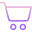
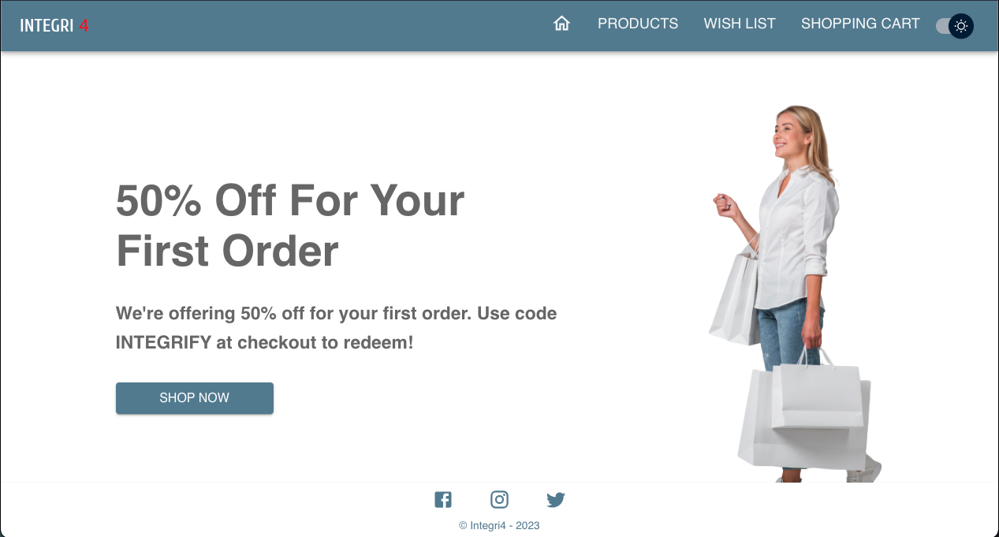

<!-- PROJECT LOGO -->

  

<h3 align="center">Integri4 - Next-gen Ecommerce App</h3>

  

    Integri4 is the Next-gen Ecommerce App built by Team 4 in 4 days
     

    <a href="https://integrifour.vercel.app/">View Demo</a>

  

<!-- TABLE OF CONTENTS -->

  
Table of Contents

  <ol>
    <li>
      <a href="#about-the-project">About The Project</a>
      <ul>
        <li><a href="#built-with">Built With</a></li>
      </ul>
    </li>
    <li><a href="#roadmap">Roadmap</a></li>
    <li><a href="#authors">Authors</a></li>
  </ol>

<!-- ABOUT THE PROJECT -->
## About The Project

The objective of this project was to develop from scratch an E-commerce website only with the following front-end languages:

### Built With

* [![React][React.js]][React-url]
* [![Redux][Redux]][Redux-url]
* [![TypeScript][TypeScript]][TypeScript-url]
* [![HTML5][HTML5]][HTML5-url]
* [![CSS3][CSS3]][CSS3-url]
* [![Material-UI][Material-UI]][Material-UI-url]

(<a href="#readme-top">back to top</a>)

<!-- ROADMAP -->
## Roadmap

- [ ] Data fetched from this [API-url]
- [ ] The user can search product by name
- [ ] The user can find product details by clicking on a product
- [ ] The user can add product(s) to the Cart and the Wish list
- [ ] When the user add a product to Wish List the favorite icon should change the color
- [ ] The user can change theme from light to dark
- [ ] The website is responsive and mobile-friendly

(<a href="#readme-top">back to top</a>)

<!-- AUTHORS -->
## Authors:
* Dragos [Dragos-url]
* Alina [Alina-url]
* Ataklti [Ataklti-url]
* Antoine [Antoine-url]

(<a href="#readme-top">back to top</a>)

<!-- MARKDOWN LINKS & IMAGES -->
<!-- https://www.markdownguide.org/basic-syntax/#reference-style-links -->
[React.js]: https://img.shields.io/badge/React-20232A?style=for-the-badge&logo=react&logoColor=61DAFB
[React-url]: https://reactjs.org/
[Redux]: https://img.shields.io/badge/Redux-593D88?style=for-the-badge&logo=redux&logoColor=white
[Redux-url]: https://redux-toolkit.js.org/
[TypeScript]: https://img.shields.io/badge/TypeScript-007ACC?style=for-the-badge&logo=typescript&logoColor=white
[TypeScript-url]: https://www.typescriptlang.org/
[HTML5]: https://img.shields.io/badge/HTML5-E34F26?style=for-the-badge&logo=html5&logoColor=white
[HTML5-url]: https://html.spec.whatwg.org/multipage/
[CSS3]: https://img.shields.io/badge/CSS3-1572B6?style=for-the-badge&logo=css3&logoColor=white
[CSS3-url]: https://www.w3.org/Style/CSS/Overview.en.html
[Material-UI]: https://img.shields.io/badge/Material--UI-0081CB?style=for-the-badge&logo=material-ui&logoColor=white
[Material-UI-url]: https://mui.com/
[API-url]: https://fakestoreapi.com/products
[Dragos-url]: https://github.com/hellodrvgos
[Alina-url]: https://github.com/AlinaCGM
[Ataklti-url]: https://github.com/B324W17
[Antoine-url]: https://github.com/Ant1ne
